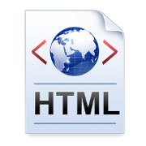
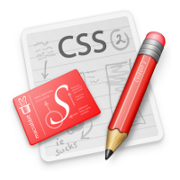
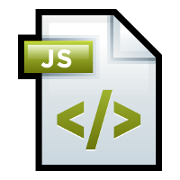

Se eu aprendi alguma coisa com o _xHTML_, foi:
Separar marcação, estilos e comportamento tornam a sua vida muito mais
feliz.

Assim como tratando-se de [acessibilidade][], quando falamos em “camadas
de desenvolvimento [*web*][]“, estamos (a grosso modo) falando de
semântica. E nisso, o [*HTML5*][] vem nos presenteando com _tags_
supimpas como a `section` e `article`.

Vamos conhecer um pouco mais sobre desenvolvimento e padrões _web_?

## Marcação com uma boa dose de semântica

Algumas referências vão chamar esta camada de “marcação”, outras vão direto ao
ponto chamando-a de “informação”. Eu gosto de pensar que é através da marcação
que damos significado a informação.

Este conceito foi fortemente utilizado no _xHTML_ (devido ao seu vínculo
com o próprio _XML_). Para dar significado a nossa informação através de
hipertexto, utilizamos o _HTML_ … e nada mais!

É nesta camada que “diremos” às máquinas que determinada parte da nossa
informação é mais relevante que a outra, que determinado bloco na
verdade é um conjunto de meta-informação ou que o bloco no fim do
arquivo contém informações menos relevantes. Sendo mais minucioso, é
nesta camada que diremos o que é um parágrafo, o que é um título, um
vínculo com outro documento, um trecho de código que mereça ênfase, uma
lista não-ordenada que servirá como menu de navegação, etc.

Não importando qual o tipo de sistema que interpretará esta informação
(_crawlers_, navegadores, leitores de e-mail ou leitores _RSS_), eles
sabem (através do padrão _HTML_) do que aquela informação se trata e
como eles devem lidar com ela.

## Embelezando com estilos

Antes de fazer minha primeira
aula de _Tableless_, eu nem fazia ideia de quão importante são as folhas
de estilos. Você já deve imaginar como eu desenvolvia para a _web_:
_WYSIWYG_ cuspindo tabelas e mais tabelas, com milhares de atributos
“font” e “color” espalhados por dezenas de arquivos.

- Um trecho de informação ser da cor verde ou azul irá afetar a
  semântica? Salvo exceções… **não.**
- Um título `h1` ser de tamanho 38px vai afetar a semântica?
  **Não.**
- A imagem de fundo utilizada no topo deste _blog_ altera o
  siginifcado deste _post_? **Não.**
- Tabelas posicionarem elementos na tela é algo semântico? **Não!**

O _Tableless_, além de defender que as tabelas devem ser usadas apenas
para dados tabulares, prega que a informação deve estar separada da
formatação. Levando em conta que hoje possuímos vários tipos de
navegadores (_desktop_, _mobile_, _embed_, leitores de tela, etc), a
informação deveria ser a mesma para todos os navegadores, mas a
formatação não.

Com o [*CSS*][] e as folhas de estilos, aplicar diferentes formatações
para um mesmo conteúdo passou a ser trivial. Antes, quando você tinha a
formatação mesclada a informação, você era obrigado a reescrever a
informação para diferentes formatos.

Outro exemplo, meu leitor [*RSS*][] não utiliza a formatação que eu
escrevi para o meu _site_ … ele utiliza uma formatação própria. Estamos
permitindo que nossa informação seja propagada em uma espécie de
“acoplamento fraco”. Para o pessoal que curte uma _buzzword_, essa é a
premissa da _Web 3.0_.

## Interação e comportamento

O [*Javascript*][] é interpretado pelo navegador. Com ele, nossas aplicações _web_ podem
fazer com que o navegador tenha um comportamento (ou interaja com os
elementos) de uma maneira diferente da usual.

Por exemplo, podemos fazer uma página inteira ser aberta de forma
assíncrona através de _Ajax_, ou podemos fazer com que nossos
formulários sejam validados antes mesmo da informação ser enviada ao
servidor. Você pode notar que fazemos com que o navegador interaja com
nossa informação de uma forma “fora do padrão”… já ouvi pessoas chamando
esta camada de “interação”, outras de “comportamento”. Na minha opinião,
a última opção faz mais sentido.

Os seus _scripts_, assim como os seus estilos, não devem estar
“mesclados” com a informação. Pense comigo, se a informação pode ser
acessada por leitores _RSS_, é bem provável que eles não entendam
_Javascript_ (ou que não entendam na plenitude de um navegador Web).
Certo?

## Considerações finais

Mas afinal de contas, como separo as camadas de desenvolvimento? Muito
simples:

- Informação deve ser sempre acessível, indiferente do estilo ou
  comportamento da sua aplicação (ou seja, só _HTML_)
- Qualquer espécie de formato que você irá aplicar deve estar contido
  em folhas de estilo _CSS_ (ou seja, fontes, tamanhos, cores)
- _Javascript_ não devem estar misturados com _HTML_! Nem mesmo em
  atributos como _onClick_ (com a _jQuery_ isso se torna muito fácil)

Sei muito bem que na prática a coisa pode não ser bem assim. Os
navegadores estão preparados para lidar com esse tipo de situação, mas
não caia nessa! Separar o seu desenvolvimento em camadas só faz bem para
você, para o seu cliente e para a sociedade.

[acessibilidade]: /tag/acessibilidade.html "Leia mais sobre Acessibilidade"
[*web*]: /tag/desenvolvimento-web.html "Leia mais sobre Web"
[*html5*]: /tag/html5.html "Leia mais sobre HTML5"
[*css*]: /tag/css3.html "Leia mais sobre CSS3"
[*rss*]: /2010/11/12/o-que-e-rss.html "O que é RSS?"
[*javascript*]: /tag/javascript.html "Leia mais sobre Javascript"
