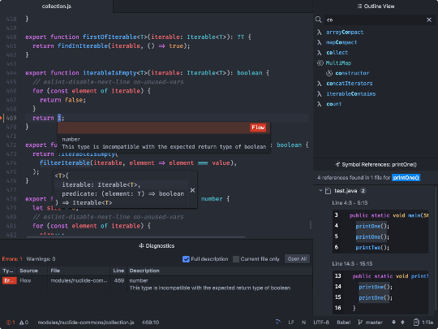
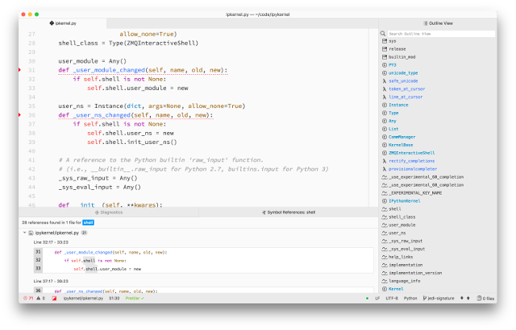

Tenho "peregrinado" por diferentes editores e _IDEs_ nesses últimos meses. Além
do [Vim](/tag/vim.html "Leia mais sobre Vim"), algumas "desventuras" com _IntelliJ IDEA_,
e [uma surpreendente experiência com o _VS Code_](/2018/06/04/eu-me-rendo-vscode.html "Eu me rendo: VS Code"),
tive a oportunidade de testar uma alternativa que sempre me deixou intrigado:
[O _Atom_](https://atom.io/ "A hackable text editor for the 21st Century")

Embora notícias recentes em relação ao editor sejam "preocupantes", o veredicto
é o melhor possível. Recomendo desde já o uso, e abaixo dou mais detalhes
sobre essa minha conclusão.

## O que é?

_Atom_ é um editor de textos, gratuito e de código aberto
([_MIT_](https://en.wikipedia.org/wiki/MIT_License "Leia mais sobre a MIT License")),
construído em [_Electron_](https://github.com/electron/electron "Leia mais sobre Electron")
(portanto, multiplataforma) e mantido pelo _GitHub_.

O editor ganha vida através de
[_Javascript_](/tag/javascript.html "Leia mais sobre Javascript")/[_CoffeeScript_](https://coffeescript.org/ "CoffeeScript is a little language that compiles into JavaScript") e
[_Less_](http://lesscss.org/ "It's CSS, with just a little more."), e com essas
mesmas tecnologias é possível estendê-lo de maneira impressionante. Aliás, o
processo de customização é muito bem documentado, no
[_Atom Flight Manual_](https://flight-manual.atom.io/ "Leia mais na página oficial"),
e escrever seus próprios _plugins_ tem uma curva de aprendizado mínima se você
já trabalhar com desenvolvimento [_web_](/tag/desenvolvimento-web.html "Leia mais sobre web").

Por padrão o _Atom_ oferece _syntax highlighting_ para uma grande gama de linguagens,
além de outros utilitários, como _fuzzy finder_, _tree view_, corretor ortográfico,
e um simples _auto-complete_.

## O que há de bom?

Gosto muito do visual do _Atom_. Na minha opinião, é um dos editores mais bonitos
disponíveis por aí. As fontes, cores (muito graças aos temas incríveis)
e ícones são renderizados de forma suave, e o "conforto visual" não pode deixar de ser
mencionado.

")

Por vir com uma configuração mais "básica"
por _default_, o editor é muito simples de usar. Sem requerer funções avançadas
(comuns em _IDEs_, como _auto-complete_, _debugging_ e _go to definition_), basta
abrí-lo e começar a escrever código. Sem dúvida ele apresenta uma interface
mais amigável que outras opções no mercado.

Como não há almoço grátis, o _Atom_ leva a fama de ser mais lento que
opções como _VS Code_ e _Vim_. E embora o time de desenvolvedores
[tenha trabalhado nessa questão](https://blog.atom.io/2017/04/18/improving-startup-time.html "Improving Startup time"),
é possível notar os "soluços" do editor em algumas ocasiões.

A integração com _Git_ (e obviamente _GitHub_) é bem interessante, e pode ajudar
bastante quem não tem intimidade com a linha de comando. E um extra bacana é o
[_Teletype_](https://teletype.atom.io/ "Collaborate in real time in Atom"):
Pacote que vem com a distribuição padrão e que permite desenvolvedores colaborarem
em _real time_ com o código aberto no editor.

Por falar em pacotes e extensões, talvez esse seja o ponto mais alto do editor.

Dentre eles vale mencionar o [_vim-mode-plus_](https://atom.io/packages/vim-mode-plus "vim-mode improved")
e o [_ex-mode_](https://atom.io/packages/ex-mode "Ex for Atom's vim-mode"). Estes
trazem os _key bindings_ do _Vim_ para o _Atom_. Eles funcionam extremamente bem
e é a "experiência _Vim-like_" mais eficiente que já experimentei.

Configurar um _set_ de _plugins_ para as suas linguagens favoritas pode
ser maçante e _error prone_. O _VS Code_ resolveu isso através de "plugins agregadores"
que acabam instalando e configurando uma série de outros _plugins_ menores para você. No
_Atom_, o _Atom-IDE_ se destaca nesse quesito.

### Atom-IDE

O [_Atom-IDE_](https://ide.atom.io/ "Improve language integration") é uma coletânea
de _plugins_ e funcionalidades que trazem características comuns em _IDEs_ para o
_Atom_.



Em uma colaboração entre _Facebook_ e _GitHub_, tornou-se possível ter um _auto-complete_
mais rico, _outline view_, _go to definition_, _find all references_, _diagnosis_,
_debugging_, _document formatting_, entre outras _features_ que você está acostumado a ver
em ferramentas como _Netbeans_ ou _Eclipse_.

A boa notícia é que existe uma grande quantidade de _plugins_ que dão [suporte a diferentes linguagens](https://atom.io/packages/search?q=IDE "Veja mais plugins de Atom-IDE"). Por exemplo,
recentemente testei o [_ide-elixir_](https://atom.io/packages/ide-elixir "Plugin para o Elixir")
e foi uma experiência muito boa.

Mas é claro que tem a má notícia...

### Facebook deixa de dar suporte

Diretamente do [_Blog do Atom_](https://blog.atom.io/2018/12/12/facebook-retires-nuclide-extension.html "Facebook retires Nuclide extension"):

> A few years ago, Facebook introduced Nuclide to provide a first-class IDE experience which included associated repos such as Atom IDE. Both Nuclide and Atom IDE were developed by Facebook and supported by an open source community. At this time, Facebook has decided to retire their open source efforts on Nuclide, the Atom IDE, and other associated repos. All of the source code will remain available in the Facebook Open Source Archives, and, if you’re interested, we encourage you to check it out and continue to build on top of it.

Na prática não há motivos para pânico. Os _plugins_ que estendem o _Atom-IDE_
para suportar diferentes linguagens são mantidos por diferentes pessoas da
comunidade. O _Facebook_ "arquivou" os repositórios do _Atom-IDE_ e _Nuclide_,
mas seu código continua disponível. O _framework_ que foi montado
até aqui deve continuar funcionando sem maiores problemas. Possíveis melhorias e correções
dependerão de contribuições da comunidade. É esperar para ver se algum grande _player_ ficará
responsável por coordenar esse esforço.

Mas com a compra do _GitHub_ pela _Microsoft_,
o _VS Code_ (da mesma _Microsoft_) [ganhando cada vez mais usuários](https://www.infoq.com/br/news/2018/12/the-rise-vscode "A crescente adoção do Visual Studio Code"), e esse anúncio do
time _Nuclide_, fica difícil não ficar com [a pulga atrás da orelha](https://news.ycombinator.com/item?id=18507817 "Is Atom now dead in the water?").

## Atom-IDE + Python

O [_ide-python_](https://atom.io/packages/ide-python) é o _plugin_ para _Atom-IDE_
que adiciona suporte à linguagem [_Python_](/tag/python.html "Leia mais sobre Python")
ao editor.



Assim como outros _plugins_ dependentes do mesmo _framework_, ele utiliza [_Language Server Protocol_](https://github.com/Microsoft/language-server-protocol "Defines a common protocol for language servers")
para habilitar recursos como _completion_ e _refactoring_. No caso do _Python_, isso é
possível através do [_python-language-server_](https://github.com/palantir/python-language-server "An implementation of the Language Server Protocol for Python"). Logo, o primeiro passo
é instalar a dependência em sua máquina:

```
$ pip install python-language-server[all]
```

Com o `[all]`, você terá disponível _completions_ e _renaming_ (através do
[_Rope_](https://github.com/python-rope/rope "Repositório do Rope")),
_linter_ e _style checking_ (através do [_Pyflakes_](https://github.com/PyCQA/pyflakes "Repositório do Pyflakes"), [_McCabe_](https://github.com/PyCQA/mccabe "Repositório do McCabe"),
[_pycodestyle_](https://github.com/PyCQA/pycodestyle "Repositório do pycodestyle") e
[_pydocstyle_](https://github.com/PyCQA/pydocstyle "Repositório do pydocstyle")) e
_code formatting_ (através de [_autopep8_](https://github.com/hhatto/autopep8 "Repositório do autopep8")
ou [_YAPF_](https://github.com/google/yapf "Repositório do YAPF")).

Na sequência, basta instalar os _plugins_ do _Atom_:

```
$ apm install atom-ide-ui
$ apm install ide-python
```

Pronto! Você já pode começar a usar o _Atom-IDE_ para escrever código _Python_.

Mas para deixar o seu ambiente ótimo, sugiro a instalação do [_atom-management_](https://atom.io/packages/atomic-management "Per-project Atom config"). Com ele, você poderá
configurar o _Python_ de acordo com o _virtualenv_ de cada projeto que esteja trabalhando:

```
$ apm install atomic-management
```

Agora basta criar o arquivo de configuração para cada projeto. Aqui está um exemplo:

```coffeescript
"*":
  "ide-python":
    pylsPlugins:
      autopep8:
        enabled: false
      yapf:
        enabled: false
    python: "/Users/klaus/.local/share/virtualenvs/yatla-kWU5r6Dm/bin/python"
```

Acima, eu propositalmente desligo o `autopep8` e `yapf`, uma vez que para este
projeto eu estou utilizando [_Black_](https://github.com/rupert/pyls-black "Black plugin for the Python Language Server"). Já na chave `python`, eu explicitamente digo qual instalação
do _Python_ pretendo utilizar.

## Considerações finais

Reforço a opinião do começo desse _post_: Recomendo.

É um editor muito amigável e confortável de usar. Os _key bidings_ do _Vim_ são
um _plus_, e além disso a documentação para criação de _plugins_
e configurações diversas é impressionante. O fato de não se render à componentização é
outro fator positivo, assim como a riqueza de pacotes e a grande comunidade em sua volta.

Mas se você é um _developer_ que gosta de seguir o _hype_, eu diria que o _Visual
Studio Code_ é uma opção mais atraente. Na dúvida, teste os dois e nos conte suas
conclusões nos comentários abaixo.

Até a próxima.

## Referências

- [Atom: Introducing Atom-IDE](https://blog.atom.io/2017/09/12/announcing-atom-ide.html)
- [Atom: Facebook retires Nuclide extension](https://blog.atom.io/2018/12/12/facebook-retires-nuclide-extension.html)
- [Hacker News: Is Atom now dead in the water?](https://news.ycombinator.com/item?id=18507817)
- [InfoQ: A crescente adoção do Visual Studio Code](https://www.infoq.com/br/news/2018/12/the-rise-vscode)
- [Wikipedia: Atom \(text editor\)](<https://en.wikipedia.org/wiki/Atom_(text_editor)>)
