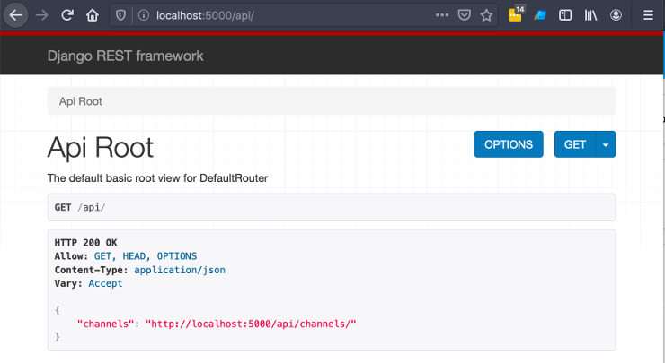

No [_post_ anterior](/2020/02/06/eu-me-rendo-django-rest-framework.html "Leia o meu depoimento sobre a rendição ao DRF")
tive a oportunidade de "destilar" a minha simpatia pelo [_Django REST Framework_](/tag/drf.html "Leia mais sobre o Django REST Framework"),
e de salientar alguns aspectos positivos da ferramenta. A praticidade
é sem dúvida um de seus pontos mais altos, e nesse _post_ vamos explorá-la através
de código escrito (que vale mais do que mil palavras).

## Instalando

Sem mais delongas, o _REST Framework_ é facilmente instalado através dos comandos `pip` ou `pipenv`:

```text
$ pipenv install djangorestframework
```

Não esqueça de adicionar a _app_ ao seu `INSTALLED_APPS`:

```python
# settings.py

INSTALLED_APPS = [
    (...)
    'rest_framework',
]
```

Estamos prontos para mergulhar nos conceitos de _routers_, serializadores e _views_.

## Antes de ir: O problema

Embora o "iMDB-clone" seja o meu tipo de exemplo favorito, dessa vez vamos imaginar que estamos desenvolvendo
um "Feedly-clone". O [_Feedly_](https://feedly.com/ "Visite o Feedly") é uma espécie de leitor [_RSS_](/2010/11/12/o-que-e-rss.html "O que é RSS?")
(com esteroides) muito popular.

Vamos focar em dois tipos específicos: `Channel` e `Item`; _Channel_ é de fato o _website_ ou _blog_ que queremos registrar em
nossa plataforma. Esse é o mesmo nome utilizado pelo formato _RSS_:

```xml
<?xml version="1.0" encoding="UTF-8" ?>
<rss version="2.0">
<channel>
 <title>RSS Title</title>
 <description>This is an example of an RSS feed</description>
 <link>http://www.example.com/main.html</link>
 <lastBuildDate>Mon, 06 Sep 2010 00:01:00 +0000 </lastBuildDate>
 <pubDate>Sun, 06 Sep 2009 16:20:00 +0000</pubDate>
 <ttl>1800</ttl>

 <item>
  <title>Example entry</title>
  <description>Here is some text containing an interesting description.</description>
  <link>http://www.example.com/blog/post/1</link>
  <guid isPermaLink="false">7bd204c6-1655-4c27-aeee-53f933c5395f</guid>
  <pubDate>Sun, 06 Sep 2009 16:20:00 +0000</pubDate>
 </item>

</channel>
</rss>
```

Já item, como ilustrado no exemplo acima, é de fato a notícia/artigo/música/podcast que aquele canal está publicando.

Então, partiremos do princípio que os seguintes modelos já estão estabelecidos:

```python
# channels/models.py

from django.db import models


class Channel(models.Model):
    title = models.CharField(max_length=255)
    description = models.TextField(blank=True, null=True)
    link = models.URLField()

    def __str__(self):
        return self.title


class Item(models.Model):
    channel = models.ForeignKey(Channel, on_delete=models.CASCADE)
    title = models.CharField(max_length=255)
    description = models.TextField(blank=True, null=True)
    link = models.URLField()
    pub_date = models.DateTimeField()

    def __str__(self):
        return self.title

```

O próximo passo será definir a _API_ para que um possível cliente _mobile_ (por exemplo) a consuma.

## Os serializadores

Segundo a [documentação oficial](https://www.django-rest-framework.org/api-guide/serializers/ "Serializers"):

> Serializers allow complex data such as querysets and model instances to be converted to native Python datatypes that can then be easily rendered into JSON, XML or other content types. Serializers also provide deserialization, allowing parsed data to be converted back into complex types, after first validating the incoming data.

Eles funcionam como um espécie de `Form`, proporcionando ferramental para o _parsing_ e validação das requisições, bem como controlando o que será mandado como _output_ para o usuário. Dentro dessa analogia, o `ModelSerializer` faz mais ou menos o que o `ModelForm` faz. Logo, um bom candidato para começarmos a escrever o _endpoint_:

```python
# channels/serializers.py

from rest_framework import serializers

from channels.models import Channel


class ChannelSerializer(serializers.ModelSerializer):
    class Meta:
        model = Channel
        fields = [
            "description",
            "link",
            "title",
        ]

```

Uma vez que estamos expondo todos os campos do modelo, é possível trocar a lista em `fields`, pela _string_ `__all__`.

## Viewsets

Continuando com as analogias, um _viewset_ seria mais ou menos o que são as _class-based views_ no _Django_. Elas abstraem uma
porção de lógica repetitiva (como _CRUD_) através de uma estrutura muito familiar aos que já possuem certa vivência com o _framework_:

```python
# channels/api.py

from rest_framework import viewsets

from channels.models import Channel
from channels.serializers import ChannelSerializer


class ChannelViewSet(viewsets.ModelViewSet):
    queryset = Channel.objects.all()
    serializer_class = ChannelSerializer

```

Note que em `queryset` apontamos para o modelo `Channel`, e em `serializer_class` para a classe serializadora criada anteriormente.

## Fazendo o roteamento

Como último passo para termos algo de fato visual, vamos mapear as rotas para o novo recurso criado.

")

Uma das vantagens de utilizar um _viewset_ é que ele também se encarrega de fazer o mapeamento das _URLs_. Por exemplo, o `ChannelViewSet` uma vez que mapeado,
responderá para rotas terminando em `/` e `/<id-do-channel>`. Além disso compreenderá que um `POST` em `/` é relacionado à criação de um novo elemento, bem como `DELETE` em `/<id-do-channel>` está relação à remoção:

```python
# urls.py

from django.urls import include, path

from rest_framework import routers
from channels.api import ChannelViewSet

api_router = routers.DefaultRouter()
api_router.register(r"channels", ChannelViewSet)

urlpatterns = [
    path("api/", include(api_router.urls)),
]

```

Nesse momento já é possível presenciar um resultado mais sólido ao acessar `http://localhost:8000/api`:



Não ligue para a porta `:5000` no exemplo acima...

Se você não é fã do _browsable api_, e não quer ter essa visão do `API Root` (como da imagem acima), troque o `DefaultRouter` por `SimpleRouter`.

## CRUD em ação

Considerando tudo o que foi dito até então, podemos esperar que temos o recurso mapeado no endereço `http://localhost:8000/api/channels`,
e que a partir desse, poderemos desempenhar a listagem, adição, edição e exclusão de dados desse recurso.

Começamos então adicionando um elemento, ao enviar o método `POST` para o endereço com final `channels/`:

```
curl -XPOST http://localhost:8000/api/channels/ --data '{
    "id": 1,
    "title": "Klaus Laube",
    "description": "Python, Django e desenvolvimento Web",
    "link": "https://klauslaube.com.br"
}' --header "Content-Type: application/json"

{"id":1,"title":"Klaus Laube","description":"Python, Django e desenvolvimento Web","link":"https://klauslaube.com.br"}
```

Como o serializador espelha as propriedades do modelo `Channel`, caso um campo obrigatório não seja enviado
no _payload_, o próprio serializador se encarregará de fazer essa validação e de retornar detalhes do erro ao usuário:

```
curl -i -XPOST http://localhost:8000/api/channels/ --data '{
    "title": "Klaus Laube",
    "description": "Python, Django, APIs, e desenvolvimento Web"
}' --header "Content-Type: application/json"

HTTP/1.1 400 Bad Request
Date: Tue, 11 Feb 2020 18:00:44 GMT
Server: WSGIServer/0.2 CPython/3.7.2
Content-Type: application/json
Vary: Accept, Cookie
Allow: GET, POST, HEAD, OPTIONS
X-Frame-Options: DENY
Content-Length: 36
X-Content-Type-Options: nosniff

{"link":["This field is required."]}
```

Como estamos falando de uma _API_ _REST_, é normal esperarmos que um `GET` no mesmo endereço traga uma lista de _channels_:

```
curl http://localhost:8000/api/channels/

[{"id":1,"title":"Klaus Laube","description":"Python, Django e desenvolvimento Web","link":"https://klauslaube.com.br"}]
```

E normalmente, um `GET` em `channels/1` deve trazer detalhes daquele recurso:

```
curl http://localhost:8000/api/channels/1/

{"id":1,"title":"Klaus Laube","description":"Python, Django e desenvolvimento Web","link":"https://klauslaube.com.br"}
```

Para atualizar o registro, enviamos o método `PUT`:

```
curl -XPUT http://localhost:8000/api/channels/1/ --data '{
    "title": "Klaus Laube",
    "description": "Python, Django, APIs, e desenvolvimento Web",
    "link": "https://klauslaube.com.br"
}' --header "Content-Type: application/json"

{"id":1,"title":"Klaus Laube","description":"Python, Django, APIs, e desenvolvimento Web","link":"https://klauslaube.com.br"}
```

E para finalizar, com `DELETE` é possível remover o recurso:

```
curl -XDELETE http://localhost:8000/api/channels/2/
```

Mágico, não?!

## Serializando relacionamentos

Passaremos a abordar agora a construção do _endpoint_ para o recurso `Item`.

")

Começamos pelo _serializer_, que não é muito diferente do construído anteriormente para o modelo `Channel`:

```python
# channels/serializers.py

(...)

class ItemSerializer(serializers.ModelSerializer):
    class Meta:
        model = Item
        fields = "__all__"

```

O `ModelSerializer` "automagicamente" fará o _parsing_ do relacionamento entre `Item` e `Channel`. O resultado da serialização de uma instância
de `Item` terá uma propriedade `channel`, com a chave primária do elemento relacionado como valor:

```text

(...)

>>> item = Item.objects.first()
>>> serializer = ItemSerializer(item)
>>> data = serializer.data

>>> print(data["channel"])
1

```

Antes de passarmos para o _viewset_, vamos discutir como ficará a _URL_ desse recurso. Se seguirmos a mesma receita utilizada para `Channel`,
teremos um endereço semelhante com o abaixo:

```text
http://localhost:8000/api/items/<id>
```

Mas que tal se `channels` fosse parte da _URL_ de `items`? É possível atingir tal resultado com o conceito de recurso aninhado.

## Nested resources

O que queremos, na prática, é o seguinte:

```text
http://localhost:8000/api/channels/<id-do-channel>/items/<id-do-item>
```

Com isso, ao acessar `channels/1/items` (por exemplo), teremos uma listagem de todos os itens relacionados
com o canal `1`.

Infelizmente o _DRF_ não possui nenhuma "classe mágica" que faça isso acontecer com poucas linhas de código. Estratégias
para atingir o mesmo resultado podem variar. Existe uma biblioteca que integra-se com o _DRF_ e produz um resultado
similar ao que queremos. Estou falando da [_drf-nested-routers_](https://github.com/alanjds/drf-nested-routers "Veja o repositório do projeto"):

```text
$ pipenv install drf-nested-routers
```

**Fica o _disclaimer_:** Como o próprio autor da biblioteca salienta na documentação, essa é uma ferramenta em estado experimental, portanto,
cogite alternativas quando estiver fazendo o _deploy_ do código para produção. Para provar o conceito apresentado nesse _post_, ela serve
perfeitamente.

Agora sim podemos continuar com o desenvolvimento do recurso `Item`:

```python
# channels/api.py

(...)


class ItemViewSet(viewsets.ModelViewSet):
    serializer_class = ItemSerializer

    def get_queryset(self):
        return Item.objects.filter(
            channel=self.kwargs["channel_pk"])

```

Note a sobrescrita do método `get_queryset`. O parâmetro `channel_pk` será passado para o `ItemViewSet` no momento
em que registrarmos a classe no `Router`. Com isso, de forma "lazy", estamos dizendo que os items pesquisados
devem ser relacionados com o `channel` mencionado no _path_ do endereço acessado.

De volta ao `urls.py`, atualizaremos o roteamento para ficar semelhante com o exemplo abaixo:

```python
# urls.py

from django.urls import include, path
from rest_framework_nested import routers

from channels.api import ChannelViewSet, ItemViewSet

api_router = routers.DefaultRouter()
api_router.register(r"channels", ChannelViewSet)

channels_router = routers.NestedDefaultRouter(
    api_router, r"channels", lookup="channel")
channels_router.register(r"items", ItemViewSet,
    basename="channel-items")

urlpatterns = [
    path("api/", include(api_router.urls)),
    path("api/", include(channels_router.urls)),
]

```

Vamos aos pontos de atenção:

- Importamos `routers` de `rest_framework_nested`, e não mais de `rest_framework`;
- Agora lidamos com duas instâncias de `Router`, a primeiro vindo de `api_router = routers.DefaultRouter()`,
  e a segunda vindo de `channels_router = routers.NestedDefaultRouter(api_router, r"channels", lookup="channel")`;
- `DefaultRouter` continua com o mesmo comportamento do exemplo anterior;
- Precisamos adicionar ao `urlpatterns` a instância de `DefaultRouter` e as instâncias de `NestedDefaultRouter`.

`NestedDefaultRouter` espera três parâmetros:

- `parent_router`: O `Router` "pai", podendo ser um `DefaultRouter` ou até mesmo outro `NestedDefaultRouter`;
- `parent_prefix`: O prefixo de _URL_ no qual os recursos registrados passarão a ser articulados como sub recursos;
- `lookup`: É a partir dessa informação que a chave `channel_pk` é criada e passada para o _viewset_.

Aqui também, se você não quiser ter a visão de _browsable api_ habilitada, troque para o `SimpleRouter`.

Pronto! O recurso `Item` está disponível para as operações exibidas anteriormente:

```text
curl http://localhost:8000/api/channels/1/items/

[{"id":1,"title":"Eu me rendo: Django REST Framework","description":"Confesso que nunca fui muito simpático ao Django REST Framework...","link":"https://klauslaube.com.br/2020/02/06/eu-me-rendo-django-rest-framework.html","pub_date":"2020-02-06T09:40:00Z","channel":1}]
```

O _payload_ retorna uma chave `channel` para cada item. Uma vez que estamos falando de um _nested resource_, não faz muito sentido retornarmos essa informação. A maneira mais prática de corrigirmos isso é alterando a classe serializadora:

```python
# channels/serializers.py

(...)

class ItemSerializer(serializers.ModelSerializer):
    class Meta:
        model = Item
        exclude = ["channel"]

```

Como queremos tudo, menos o `channel`, utilizamos a propriedade `exclude` ao invés de `fields`, e determinamos o que queremos excluir da resposta.

## Considerações finais

Há muito o que ser discutido ainda, como customização, autenticação, segurança, _HATEOAS_, etc. Assuntos esses que pretendo abordar em _posts_ vindouros.

Com o mínimo coberto no _getting started_ da documentação do _DRF_, já é
possível termos algo _up & running_. Provar conceitos e discutir contratos
passou a ser muito menos custoso graças à biblioteca.

Essa "proximidade" de conceitos como serializadores e _viewsets_, com conceitos bem estabelecidos do _Django_ (como _forms_ e _class-based views_) faz com que o atrito seja menor, e a curva de aprendizagem mais baixa. É quase natural compreender tais artefatos à primeira vista.

Se o seu projeto é feito em _Django_, e você necessita escrever _APIs_ _REST_, não perca tempo e caia de cabeça no _REST Framework_.

Até a próxima.

## Referências

- [Django REST Framework - Quickstart](https://www.django-rest-framework.org/tutorial/quickstart/)
- [Wikipedia - RSS](https://en.wikipedia.org/wiki/RSS)
