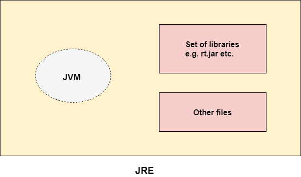
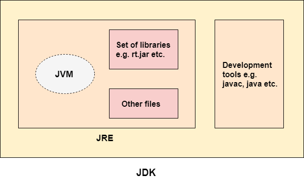
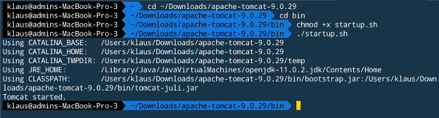
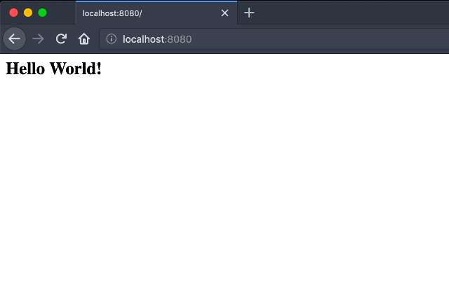

Uma constante nesses dois últimos anos da minha vida profissional tem sido "reavaliar" algumas opiniões que tive durante a minha carreira. Não à toa costumo escrever [alguns artigos do tipo "eu me rendo"](/2017/04/19/eu-me-rendo-material-design.html "Já me rendi até ao Material Design"). Já me rendi ao [VS Code, ao uso de IDEs](/2018/06/04/eu-me-rendo-vscode.html "Relato onde admito estar traindo o Vim"), e até mesmo ao _React_. Agora chegou a hora do [_Java_](/tag/java.html "Leia mais sobre Java").

[_Python_](/tag/python.html "Leia mais sobre Python") ainda é de longe a minha linguagem favorita. Mas acabei "caindo de paraquedas" no mundo _Java_ (principal linguagem usada aqui na [_Tradeshift_](https://tradeshift.com/ "Reimagine procure-to-pay")), e assim como o _Python_ enriqueceu o meu conhecimento quando me rendi a ele (minha primeira linguagem foi o [_PHP_](/tag/php.html "Leia mais sobre PHP")), o _Java_ tem feito o mesmo.

")

Após essa longa argumentação exibindo a motivação por trás desse _post_, vamos ao que interessa: _Java_ para a [_web_](/tag/desenvolvimento-web.html "Leia mais sobre web") pode ser divertido...

... só precisa ter um pouquinho de paciência.

## Linguagem x Ambiente

Parece chover no molhado, mas quando falamos em _Java_ temos que levar sempre em consideração que estamos referenciando duas coisas: A linguagem de programação e a plataforma.

Sobre a linguagem, é exatamente aquele mesmo discurso que a gente já está cansado de ouvir: Orientada a objetos, de alto nível, estática e de tipagem forte.

")

### Plataformas e a sopa de letrinha

As plataformas _Java_ possuem a _Java Virtual Machine_ (_JVM_) e uma _API_ (_Application Programming Interface_). A primeira é quem "executa" aplicações _Java_ para uma determinada plataforma de _hardware_ e _software_. Já a segunda é uma coleção de componentes usados para criação de outros componentes e aplicações.

A _Java Runtime Environment_ (_JRE_) provê o ambiente necessário para executar aplicações _Java_. Inclui implementação da _JVM_ juntamente com bibliotecas e outros arquivos necessários para sua execução.



Para escrever código _Java_ utiliza-se um conjunto de ferramentas de desenvolvimento chamado de _Java Development Kit_ (_JDK_). Entre essas ferramentas está o compilador, o _debugger_ _Java_, e a própria _JRE_.



O _Java_ é uma linguagem de propósito genérico, portanto, há diferentes especificações (e fatalmente implementações) que auxiliam na construção de soluções para diferentes fins. As mais mencionadas sendo:

- _Java Standard Edition (SE)_: Disponibiliza as funcionalidades "core" da linguagem. De tipos básicos a classes de alto nível que lidam com _networking_, segurança, _parsing_, _math_, entre outros. Além disso, consiste de máquina virtual, ferramentas de desenvolvimento, tecnologias de _deployment_, etc;
- _Java Enterprise Edition (EE)_: Construída em cima da anterior, disponibiliza _API_ e ambiente de execução para ambientes "enterprise" de larga escala e distruídos. Aqui encontraremos os componentes mais comuns para construção de aplicações _web_;
- _Java Micro Edition (ME)_: Também construída em cima da _SE_, disponibiliza uma máquina virtual própria para dispositivos menores (como _smartphones_ e embarcados).

Confuso? Isso que [nem falamos de _OpenJDK_](https://www.baeldung.com/oracle-jdk-vs-openjdk "Leia mais sobre no Baeldung")...

## Tudo começa pelo servidor de aplicação

O motivo no qual estamos lidando com essa quantidade de acrônimos é para compreendermos que, quando estamos falando do servidor de aplicações (que será o ambiente no qual executaremos a nossa aplicação _web_), estamos falando do "domínio" do _Java EE_.

Segundo a [apostila de _Java_ para _web_](https://www.caelum.com.br/apostila-java-web/o-que-e-java-ee/ "Leia o trecho completo no material original"), da _Caelum_:

> (...) o Java EE é um grande conjunto de especificações. Essas especificações, quando implementadas, vão auxiliar bastante o desenvolvimento da sua aplicação, pois você não precisará se preocupar com grande parte de código de infraestrutura, que demandaria muito trabalho.

Ainda citando a fonte acima:

> Existem diversas dessas implementações. Já que esse software tem papel de servir sua aplicação para auxiliá-la com serviços de infraestrutura, esse software ganha o nome de servidor de aplicação. A própria Sun/Oracle desenvolve uma dessas implementações, o Glassfish que é open source e gratuito (...).

Vamos utilizar uma ferramenta que implementa apenas parte da especificação do _Java EE_, não sendo por definição um "servidor de aplicação completo", mas nem por isso deixando de atender nossos requisitos. No momento, só estamos interessados no _Java ServerPages_ (_JSP_) e em _Servlets_, e há um _software_ extremamente popular que entrega isso para a gente.

### Tomcat

[Segundo o _Wikipedia_](https://en.wikipedia.org/wiki/Apache_Tomcat "Leia mais no artigo original"):

> Apache Tomcat (sometimes simply "Tomcat") is an open source implementation of the Java Servlet, JavaServer Pages, Java Expression Language and WebSocket technologies. (...) provides a "pure Java" HTTP web server environment in which Java code can run.

Exatamente o que precisamos!

Instalá-lo é simples:

- Faça o _download_ no [tomcat.apache.org](https://tomcat.apache.org "Site oficial do Tomcat");
- Descompacte no diretório de sua preferência;
- Tenha certeza que o arquivo `startup.sh` tem permissão de execução;
- Execute o arquivo;
- Abra o endereço `http://localhost:8080`;
- Se tudo estiver certo, você deve ver a mensagem em verde `If you're seeing this, you've successfully installed Tomcat. Congratulations!`.



Mas a maneira que considero mais prática é manuseá-lo através de alguma ferramenta de _build_. No caso desse tutorial, usaremos o _Maven_.

Não esqueça de desligar o _Tomcat_ através do `./shutdown.sh`.

### Maven

Com o _Maven_ você controlará grande parte do ciclo de vida da sua aplicação, resolvendo dependências, executando testes, compilando o projeto, etc. Com ele você pode também criar o projeto utilizando o arquétipo de _webapp_, como ilustrado no exemplo abaixo:

```text
$ mvn archetype:generate
    -DgroupId=com.kplaube
    -DartifactId=ola-mundo
    -DarchetypeArtifactId=maven-archetype-webapp
    -DinteractiveMode=false
```

Onde:

- `-DgroupId`: O _namespace_ utilizado para empacotamento
- `-DartifactId`: O nome do projeto
- `-DarchetypeArtifactId`: O nome do "template" usado como base para criar arquivos e diretórios
- `-DinteractiveMode`: Desabilitar o modo interativo

Uma porção de pacotes serão baixados. Sente e relaxe... aproveite para ver mais informações sobre [como instalar o _Maven_](https://maven.apache.org/install.html "Installing Apache Maven").

Ainda falta "linkar" o _Tomcat_ ao processo de _build_. Entre no diretório `ola-mundo`, recém criado, e abra o arquivo `pom.xml` (_Project Object Model_, arquivo utilizado pelo _Maven_). Altere-o para ficar parecido com o exemplo abaixo:

```xml
<project xmlns="http://maven.apache.org/POM/4.0.0" xmlns:xsi="http://www.w3.org/2001/XMLSchema-instance"
xsi:schemaLocation="http://maven.apache.org/POM/4.0.0 http://maven.apache.org/maven-v4_0_0.xsd">
    <modelVersion>4.0.0</modelVersion>
    <groupId>com.kplaube</groupId>
    <artifactId>ola-mundo</artifactId>
    <packaging>war</packaging>
    <version>1.0-SNAPSHOT</version>
    <name>ola-mundo Maven Webapp</name>
    <url>http://maven.apache.org</url>
    <build>
        <finalName>ola-mundo</finalName>
        <plugins>
            <!-- Tomcat plugin -->
            <plugin>
                <groupId>org.apache.tomcat.maven</groupId>
                <artifactId>tomcat7-maven-plugin</artifactId>
                <version>2.2</version>
                <configuration>
                    <path>/</path>
                    <webapps>
                        <webapp>
                            <contextPath>/</contextPath>
                            <groupId>com.kplaube</groupId>
                            <artifactId>ola-mundo</artifactId>
                            <version>1.0-SNAPSHOT</version>
                            <type>war</type>
                            <asWebapp>true</asWebapp>
                        </webapp>
                    </webapps>
                </configuration>
            </plugin>
        </plugins>
    </build>
</project>
```

De volta à linha de comando:

```text
$ mvn tomcat7:run
```

O _Maven_ "baixará toda a _internet_" novamente. Ao final do processo, ao acessar o endereço `http://localhost:8080`, será possível ver a página com `Hello World!`.



"Só" precisou de um _post_ inteiro para chegarmos até aqui. Sucesso!

## Considerações finais

Um monte de mágica aconteceu, e você (assim como eu no meu cotidiano) terá que confiar que as coisas simplesmente estão funcionando.

Por enquanto, vamos abstrair os detalhes do _Maven_. Corremos um pouco aqui no final para ter algo prático como exemplo, mas com certeza abordaremos a ferramenta com frequência nos próximos _posts_.

Por hora, é preciso "aceitar" que com o uso do `tomcat7-maven-plugin` ganhamos o utilitário de linha de comando `tomcat7:run`, do qual empacota e executa a aplicação. E embora tenhamos investido parágrafos falando de _Java EE_, e posteriormente de _Tomcat_, na prática nota-se que pouco precisamos nos importar com isso para ter um "hello world" _up and runnig_ com "investimento modesto".

No próximo artigo partiremos enfim para os _Servlets_ e _Java ServerPages_.

Até lá!

## Referências

- [Caelum: Apostila Java para Desenvolvimento Web - O que é Java EE?](https://www.caelum.com.br/apostila-java-web/o-que-e-java-ee/)
- [JavaTPoint: Difference between JDK, JRE, and JVM](https://www.javatpoint.com/difference-between-jdk-jre-and-jvm)
- [Oracle.com: Differences between Java EE and Java SE](https://docs.oracle.com/javaee/6/firstcup/doc/gkhoy.html)
- [spsarolkar.github.io: Running web applications with tomcat maven plugin](https://spsarolkar.github.io/esp8266/2018/03/18/Run-webapplications-using-tomcat-maven-plugin.html)
- [StackOverflow: Can JavaSE be used to write a web application?](https://stackoverflow.com/questions/1900673/can-javase-be-used-to-write-a-web-application#1900693)
- [StackOverflow: Difference between Java SE/EE/ME?](https://stackoverflow.com/questions/2857376/difference-between-java-se-ee-me)
- [Wikipedia: Java](https://en.wikipedia.org/wiki/Java_%28programming_language%29)
- [Wikipedia: Maven](https://en.wikipedia.org/wiki/Apache_Maven)
- [Wikipedia: Tomcat](https://en.wikipedia.org/wiki/Apache_Tomcat)
