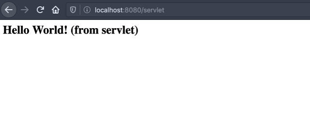
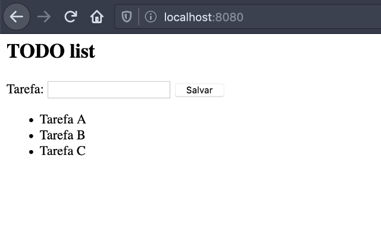

No [_post_ anterior](/2019/11/28/engatinhando-em-java-web-parte-1.html "Engatinhando em Java para a web - Parte 1") demos uma breve pincelada sobre _JDK_, _JRE_, _JSE_ e _JEE_. Uma vez que temos a infrastrutura funcionando para os fins desse artigo, através do uso de _Maven_ e _Tomcat_, vamos partir para uma abordagem mais prática, e finalmente falar sobre os famosos _Servlets_.

Mas antes de continuar, um breve _disclaimer_.

## Disclaimer

Recebi alguns _feedbacks_ sobre o artigo anterior, questionando sobre a abordagem em relação a _Servlets_, _JavaServer Pages_ e até mesmo ao _Tomcat_ e _Maven_. Existem escolhas mais "sexy" (principalmente aos três últimos citados), e que em relação ao _Servlets_ a escolha mais natural seria a adoção de algum _framework_ que abstraia todo esse "javanês" (como [_SpringBoot_](https://spring.io/projects/spring-boot "Página oficial do Spring Boot") ou [_Play_](https://www.playframework.com/ "Página oficial do projeto Play")).

")

A narrativa dessa série de artigos tem justamente a intenção de ilustrar que em um primeiro momento, [_Java_](/tag/java.html "Leia mais sobre Java") para [_web_](/tag/desenvolvimento-web.html "Leia mais sobre web") pode parecer obsoleto, mas que com o progredir dos _posts_ novas tecnologias serão apresentadas e que por fim, é possível sim ter um ambiente deveras moderno e prático.

Estamos "engatinhando", afinal...

Obrigado pelos _feedbacks_ :)

## Servlets

_Servlet_ pode ser comparado ao [_Common Gateway Interface_](/2012/11/02/entendendo-o-cgi-fastcgi-e-wsgi.html "Entendendo o CGI") (_CGI_), onde há um "acordo" o servidor _web_ ou de aplicação, e a sua aplicação. As definições podem vir das mais variadas formas:

- É uma tecnologia usada para a criação de aplicações _web_ em _Java_.
- É uma _API_ que disponibiliza classes, interfaces e documentação necessárias para tal operação.
- É uma classe que estende as capacidades de servidores e reage à requisições (de qualquer tipo).
- É um componente _web_ que cria páginas dinâmicas para a _web_.

Mas talvez a melhor definição venha (novamente) da [apostila de _Java_ para _web_](https://www.caelum.com.br/apostila-java-web/servlets/ "Capítulo 5 - Servlets") da _Caelum_:

> Uma primeira ideia da servlet seria que cada uma delas é responsável por uma página, sendo que ela lê dados da requisição do cliente e responde com outros dados (uma página HTML, uma imagem GIF etc). Como no Java tentamos sempre que possível trabalhar orientado a objetos, nada mais natural que uma servlet seja representada como um objeto a partir de uma classe Java.

_Neha Vaidya_ descreve de forma simples e didática o ciclo de vida de um _servlet_ em uma [_thread_ do _Quora_](https://www.quora.com/What-is-servlet/answer/Neha-Vaidya-24 "What is servlet?"), no qual vou traduzir abaixo:

- Quando o servidor _web_ (ex.: _Apache Tomcat_) inicia, o _servlet container_ "deploia" e carrega todos os _Servlets_;
- O _servlet_ é inicializado chamando o método `init()`. O método `Servlet.init()` é chamado pelo _servlet container_ para indicar que essa _servlet instance_ foi iniciada com sucesso e está pronta para responder;
- O _servlet_ então chama o método `service()` para processar uma requisição do cliente;
- O _servlet_ é terminado ao chamar o método `destroy()`;
- Então o `destroy()`, executado no fim do ciclo de vida do _servlet_ sinaliza o fim da _servlet instance_.

")

`init` e `destroy` são chamados apenas uma vez. Por fim, o _servlet_ é coletado pelo _gargabe collector_ da _JVM_.

## Um pouco de prática

Dentro do contexto da linguagem _Java_, a `Servlet` também é uma `Interface`. No nosso escopo, falando de desenvolvimento _web_, usaremos uma implementação mais especializada para trabalhar com o protocolo _HTTP_, chamada `HttpServlet`.

Voltando ao projeto `ola-mundo`, criado no artigo anterior, vamos adicionar a _servlet API_ como dependência do projeto. Antes do nó `<build>`, acrescente o seguinte:

```xml
<properties>
    <maven.compiler.source>11</maven.compiler.source>
    <maven.compiler.target>11</maven.compiler.target>
</properties>

<dependencies>
    <dependency>
        <groupId>javax.servlet</groupId>
        <artifactId>javax.servlet-api</artifactId>
        <version>4.0.1</version>
        <scope>provided</scope>
    </dependency>
</dependencies>
```

Altere o `maven.compiler.source` para a versão do _Java_ que você estiver utilizando no momento.

Na sequência, crie o pacote onde escreveremos a classe:

```text
$ mkdir -p src/main/java/webapp
```

Uma vez na pasta, crie o arquivo `OlaMundoServlet.java` com o seguinte conteúdo:

```java
// src/main/java/webapp/OlaMundoServlet.java
package webapp;

import java.io.IOException;
import java.io.PrintWriter;
import javax.servlet.ServletException;
import javax.servlet.annotation.WebServlet;
import javax.servlet.http.HttpServlet;
import javax.servlet.http.HttpServletRequest;
import javax.servlet.http.HttpServletResponse;

@WebServlet(urlPatterns = "/servlet")
public class OlaMundoServlet extends HttpServlet {

    @Override
    protected void service(HttpServletRequest req, HttpServletResponse resp) throws ServletException, IOException {
        PrintWriter out = resp.getWriter();

        out.println("<html>");
        out.println("<body>");
        out.println("<h2>Hello World! (from servlet)</h2>");
        out.println("</body>");
        out.println("</html>");
    }
}
```

Execute novamente o comando `mvn clean tomcat7:run`, e acesse o endereço `http://localhost:8080/servlet`. Bingo!



### Mais razão, menos magia

A partir da especificação _Servlet 3_, é possível utilizar [_annotations_](https://docs.oracle.com/javase/tutorial/java/annotations/ "Leia mais na documentação da Oracle") para configurar o _deployment_ do _servlet_. Com essa forma mais "programática" não é necessário alterar o arquivo `WEB-INF/web.xml`, e o resultado final fica (na minha opinião) mais prático de ser gerenciado.

")

Com a anotação `@WebServlet` mapeamos um nome e rota específicos (`/servlet`) ao _servlet_ em questão. O _servlet container_ irá reconhecê-lo e fará a ligação entre rota e classe _Java_.

Há mais vantagens (e _annotations_) disponíveis com essa versão da especificação. Para saber mais, o "[An Overview of Servlet 3.0](https://dzone.com/articles/an-overview-servlet-30 "Leia mais do DZone")", do site _DZone_, traz um breve resumo.

## JavaServer Pages

Você deve estar se perguntando: De onde veio aquele "Hello World!", do endereço `http://localhost:8080/`?

Ele veio do arquivo `index.jsp`:

```text
$ cat src/main/webapp/index.jsp

<html>
<body>
<h2>Hello World!</h2>
</body>
</html>
```

Segundo o _Wikipedia_:

> JavaServer Pages (JSP) is a collection of technologies that helps software developers create dynamically generated web pages based on HTML, XML, SOAP, or other document types. (...) JSP is similar to PHP and ASP, but it uses the Java programming language.

> To deploy and run JavaServer Pages, a compatible web server with a servlet container, such as Apache Tomcat or Jetty, is required.

Na prática, _JSP_ é uma abstração de _servlet_. Os arquivos _JSP_ são traduzidos em _servlets_ durante o _runtime_, resultando em algo similar com o que fizemos ao escrever o nosso próprio:

```text
$ cat target/tomcat/work/Tomcat/localhost/_/org/apache/jsp/index_jsp.java

package org.apache.jsp;

import javax.servlet.*;
import javax.servlet.http.*;
import javax.servlet.jsp.*;

public final class index_jsp extends org.apache.jasper.runtime.HttpJspBase
    implements org.apache.jasper.runtime.JspSourceDependent {

    (...)

    public void _jspInit() {
        (...)
    }

    public void _jspDestroy() {
    }

    public void _jspService(final javax.servlet.http.HttpServletRequest request,
                            final javax.servlet.http.HttpServletResponse response)
            throws java.io.IOException, javax.servlet.ServletException {

        (...)

        out.write("<html>\n");
        out.write("<body>\n");
        out.write("<h2>Hello World!</h2>\n");
        out.write("</body>\n");
        out.write("</html>\n");

        (...)
    }
}
```

Estamos em 2019, e já estamos cansados de saber que misturar _HTML_ com sua regra de negócios não é uma boa ideia. Uma alternativa seria alterar o _servlet_ que escrevemos e utilizar o _JSP_ como uma espécie de "template engine". Paramos de imprimir _HTML_ e deixamos a linguagem lidar com esse tipo de trabalho (~mais ou menos o que se faz usando [_JSX_](https://reactjs.org/docs/introducing-jsx.html "Note as aspas irônicas")~):

```java
// src/main/java/webapp/OlaMundoServlet.java
package webapp;

import java.io.IOException;
import javax.servlet.RequestDispatcher;
import javax.servlet.ServletException;
import javax.servlet.annotation.WebServlet;
import javax.servlet.http.HttpServlet;
import javax.servlet.http.HttpServletRequest;
import javax.servlet.http.HttpServletResponse;

@WebServlet(urlPatterns = "/servlet")
public class OlaMundoServlet extends HttpServlet {

    @Override
    protected void service(HttpServletRequest req, HttpServletResponse resp) throws ServletException, IOException {
        RequestDispatcher rd = req.getRequestDispatcher("/index.jsp");
        rd.forward(req, resp);
    }
}
```

É isso mesmo o que você está lendo: Redirecionamos a requisição do "nosso _servlet_" para o _JSP_ (que também é um _servlet_). Respeitamos a especificação e conseguimos dividir as responsabilidades. Não aparenta ser bonito, mas pelo menos por hora já conseguimos separar o que é o nosso controlador do que é a nossa visualização.

### Traçando nova rota

O `index.jsp` ainda está acessível através do endereço `/`. Para ocultá-lo do acesso público, mova-o para a pasta `WEB-INF`:

```text
$ mv src/main/webapp/index.jsp src/main/webapp/WEB-INF
```

Ao executar o _Tomcat_ novamente, ambos endereços (`/` e `/servlet`) devem apresentar uma resposta `404` agora (já que o recurso público `index.jsp` não existe mais). Na _annotation_ `@WebServlet`, altere o _path_ para fazê-lo virar a _index_ da aplicação:

```java
@WebServlet(urlPatterns = "")
```

O próximo passo agora é dizer para o `RequestDispatcher` a nova localização do `index.jsp`:

```java
RequestDispatcher rd = req.getRequestDispatcher("/WEB-INF/index.jsp");
```

Reinicie o _Tomcat_ (`mvn clean tomcat7:run`) e acesse o `http://localhost:8080`.

Funciona!

## Deixando um pouquinho mais dinâmico

Com o que temos aqui já é possível prototipar uma aplicação simples. Vamos imaginar uma lista de tarefas (_such a cliché_!), onde eu tenho um campo para adicionar uma tarefa e uma lista com as mesmas logo abaixo. Para deixar tudo simples, vamos continuar com o projeto `ola-mundo`.

Altere o `index.jsp` para o seguinte código _HTML_:

```html
<html>
  <body>
    <h2>TODO list</h2>

    <form action="" method="post">
      <label>
        Tarefa:
        <input type="text" name="nome" required />
      </label>

      <input type="submit" value="Salvar" />
    </form>
    <ul>
      <li>Tarefa</li>
    </ul>
  </body>
</html>
```

Fica óbvio que precisaremos de um elemento que represente uma tarefa. Se formos por uma abordagem _MVC_, faria sentido categorizar esse elemento como um modelo:

```text
$ mkdir -p src/main/java/webapp/modelo
$ touch src/main/java/webapp/modelo/Tarefa.java
```

A classe será muito simples:

```java
// src/main/java/webapp/modelo/Tarefa.java
package webapp.model;

public class Tarefa {
    protected String nome;

    public Tarefa(String nome) {
        this.nome = nome;
    }

    public void setNome(String nome) {
        this.nome = nome;
    }

    public String getNome() {
        return nome;
    }
}
```

E o _servlet_ deverá ficar parecido com o seguinte:

```java
// src/main/java/webapp/OlaMundoServlet.java
package webapp;

(...)

import webapp.model.Tarefa;

@WebServlet(urlPatterns = "")
public class OlaMundoServlet extends HttpServlet {

    @Override
    protected void service(HttpServletRequest req, HttpServletResponse resp) throws ServletException, IOException {
        List<Tarefa> tarefas = List.of(
                new Tarefa("Tarefa A"),
                new Tarefa("Tarefa B"),
                new Tarefa("Tarefa C")
        );
        req.setAttribute("tarefas", tarefas);

        RequestDispatcher rd = req.getRequestDispatcher("/WEB-INF/index.jsp");
        rd.forward(req, resp);
    }
}
```

Note que estamos passando uma lista (estática) de tarefas como atributo da requisição (`req.setAttribute`) que acionará o `index.jsp`. O próximo passo é imprimir tais tarefas no _JSP_.

### (Unified) Expression Language

O _JSP_ possui um recurso chamado de _Scriptlets_, que permite que você escreva de forma explícita código _Java_ em arquivos _JSP_ através de _scripts_ (mais ou menos o que podemos ver em linguagens como _PHP_ e _ASP_). Se você parar para considerar que _JSP_ é no fundo código _Java_ imprimindo _HTML_, essa ideia não parece ser tão louca assim.

Oras... estamos em 2019, e já estamos cansados de saber que escrever _HTML_ misturado com lógica de negócios não é uma boa ideia.

")

A partir da versão 2.0 da especificação do _JSP_ temos uma alternativa chamada "Expression Language" (ou _Unified Expression Language_, a partir da versão 2.1).

Segundo o [_Wikipedia_](https://en.wikipedia.org/wiki/Unified_Expression_Language "Leia mais sobre EL"):

> The Java Unified Expression Language is a special purpose programming language mostly used in Java web applications for embedding expressions into web pages. The Java specification writers and expert groups of the Java web-tier technologies have worked on a unified expression language which was first included in the JSP 2.1 specification (JSR-245), and later specified by itself in JSR-341, part of Java EE 7.

Com ela, ao invés de escrevermos isso (quem teve contato com _PHP_ achará muito familiar):

```html
<li><%= tarefa.getNome() %></li>
```

Escrevemos isso (similar a qualquer _engine_ de _templates_):

```html
<li>${tarefa.nome}</li>
```

A _EL_ não é capaz de realizar operações como um `for`, por exemplo. Para isso, se quisermos "fugir" do uso de _scripts_, temos um outro recurso à disposição.

### Taglibs

Voltando a citar o [material da _Caelum_](https://www.caelum.com.br/apostila-java-web/usando-taglibs/ "Usando Taglibs"):

> A Sun percebeu que os programadores estavam abusando do código Java no JSP e tentou criar algo mais "natural" (um ponto um tanto quanto questionável da maneira que foi apresentada no início), sugerindo o uso de tags para substituir trechos de código.

> O resultado final é um conjunto de tags (uma tag library, ou taglib) padrão, que possui, entre outras tags, a funcionalidade de instanciar objetos através do construtor sem argumentos.

Com esse recurso, ao invés de escrevermos isso:

```html
<ul>
  <% for (Tarefa tarefa : tarefas ) { %>
  <li><%= tarefa.getNome() %></li>
  <% } %>
</ul>
```

Escreveremos isso:

```html
<%@ taglib uri="http://java.sun.com/jsp/jstl/core" prefix="c" %>

(...)

<ul>
    <c:forEach var="tarefa" items="${tarefas}">
        <li>${tarefa.nome}<li>
    </c:forEach>
</ul>
```

E embora possa ser tentador cair na armadilha de discutir qual opção é melhor, eu diria que **nenhuma delas**. Considere uma terceira alternativa, como o [_Thymeleaf_](https://www.thymeleaf.org/doc/articles/thvsjsp.html "Spring MVC view layer: Thymeleaf vs. JSP"), e não invista muito esforço nesse debate. Estamos em 2019, e discutir sobre _JSP x Taglibs_ é "tão anos 2000".

Por hora, vamos "aceitar" a combinação _EL_ + _JSTL_.

### Aplicando as alterações

Primeiro, precisamos alterar os atributos do nó `web-app`, do arquivo `web.xml`:

```xml
<!DOCTYPE web-app PUBLIC
"-//Sun Microsystems, Inc.//DTD Web Application 2.3//EN"
"http://java.sun.com/dtd/web-app_2_3.dtd" >

<web-app
        xmlns="http://java.sun.com/xml/ns/javaee"
        xmlns:xsi="http://www.w3.org/2001/XMLSchema-instance"
        xsi:schemaLocation="http://java.sun.com/xml/ns/javaee
http://java.sun.com/xml/ns/javaee/web-app_3_0.xsd" version="3.0">

<display-name>Archetype Created Web Application</display-name>
</web-app>
```

Na sequência, precisamos instalar a interface de _JSTL_, bem como sua implementação. Altere o arquivo `pom.xml` para ficar semelhante ao seguinte:

```xml
<project xmlns="http://maven.apache.org/POM/4.0.0" xmlns:xsi="http://www.w3.org/2001/XMLSchema-instance"
        xsi:schemaLocation="http://maven.apache.org/POM/4.0.0 http://maven.apache.org/maven-v4_0_0.xsd">
    <modelVersion>4.0.0</modelVersion>
    <groupId>com.kplaube</groupId>
    <artifactId>ola-mundo</artifactId>
    <packaging>war</packaging>
    <version>1.0-SNAPSHOT</version>
    <name>ola-mundo Maven Webapp</name>
    <url>http://maven.apache.org</url>

    <properties>
        <maven.compiler.source>11</maven.compiler.source>
        <maven.compiler.target>11</maven.compiler.target>
    </properties>

    <dependencies>
        <!-- Servlet -->
        <dependency>
            <groupId>javax.servlet</groupId>
            <artifactId>javax.servlet-api</artifactId>
            <version>4.0.1</version>
            <scope>provided</scope>
        </dependency>

        <!-- JSTL -->
        <dependency>
            <groupId>javax.servlet</groupId>
            <artifactId>jstl</artifactId>
            <version>1.1.2</version>
        </dependency>
        <dependency>
            <groupId>taglibs</groupId>
            <artifactId>standard</artifactId>
            <version>1.1.2</version>
        </dependency>
        <dependency>
            <groupId>taglibs</groupId>
            <artifactId>c</artifactId>
            <version>1.1.2</version>
            <type>tld</type>
        </dependency>
    </dependencies>

    <build>
        <finalName>ola-mundo</finalName>
        <plugins>
            <!-- Tomcat plugin -->
            <plugin>
                <groupId>org.apache.tomcat.maven</groupId>
                <artifactId>tomcat7-maven-plugin</artifactId>
                <version>2.2</version>
                <configuration>
                    <path>/</path>
                    <contextReloadable>true</contextReloadable>
                </configuration>
            </plugin>
        </plugins>
    </build>
</project>
```

Já o _HTML_, no arquivo `index.jsp`, deve ficar parecido com o seguinte:

```html
<%@ taglib uri="http://java.sun.com/jsp/jstl/core" prefix="c" %>
<html>
  <body>
    <h2>TODO list</h2>

    <form action="" method="post">
      <label>
        Tarefa:
        <input type="text" name="nome" required="required" />
      </label>

      <input type="submit" value="Salvar" />
    </form>
    <ul>
      <c:forEach var="tarefa" items="${tarefas}">
        <li>${tarefa.nome}</li>
      </c:forEach>
    </ul>
  </body>
</html>
```

Reinicie o _Tomcat_, e ao acessar o endereço `http://localhost:8080`, você deve obter o seguinte resultado:



## Considerações finais

Embora haja uma forma programática de formularmos o _deployment descriptor_ da aplicação, ainda assim precisamos lidar com escrita de _XML_ que em muitos casos parecem ser alterações exotéricas. Mesmo com a _Servlet 3.0_, não escapamos dessa espécie de "karma" que é lidar com a linguagem _Java_.

No entanto, _frameworks_ como o _Spring_ tendem a eliminar essa necessidade, tornando tudo um pouco mais interessante, principalmente para desenvolvedores acostumados com ambientes mais "dinâmicos" como [_Python_](/tag/python.html "Leia mais sobre Python"), _Ruby_ ou _Node.js_. Mas infelizmente, não atacaremos essa transição no próximo _post_...

No próximo artigo, finalizaremos a prototipação com a parte da adição da tarefa. Abordaremos brevemente filtros e _listeners_, e fecharemos essa parte da trinca _Servlet + Tomcat + Maven_.

Até lá.

## Referências

- [Caelum: Apostila Java para Desenvolvimento Web - JavaServer Pages](https://www.caelum.com.br/apostila-java-web/javaserver-pages/)
- [Caelum: Apostila Java para Desenvolvimento Web - Servlets](https://www.caelum.com.br/apostila-java-web/servlets/)
- [DZone: An Overview of Servlet 3.0](https://dzone.com/articles/an-overview-servlet-30)
- [JavaTPoint: Life Cycle of a Servlet (Servlet Life Cycle)](https://www.javatpoint.com/life-cycle-of-a-servlet)
- [JavaTPoint: Servlet with Annotation (feature of servlet3)](https://www.javatpoint.com/servlet-with-annotation)
- [Quora: Should I learn JSP and servlets in 2019?](https://www.quora.com/Should-I-learn-JSP-and-servlets-in-2019)
- [Quora: What is servlet?](https://www.quora.com/What-is-servlet)
- [Thymeleaf: Thymeleaf vs. JSP](https://www.thymeleaf.org/doc/articles/thvsjsp.html)
- [Wikipedia: JavaServer Pages](https://en.wikipedia.org/wiki/JavaServer_Pages)
- [Wikipedia: Unified Expression Language](https://en.wikipedia.org/wiki/Unified_Expression_Language)
