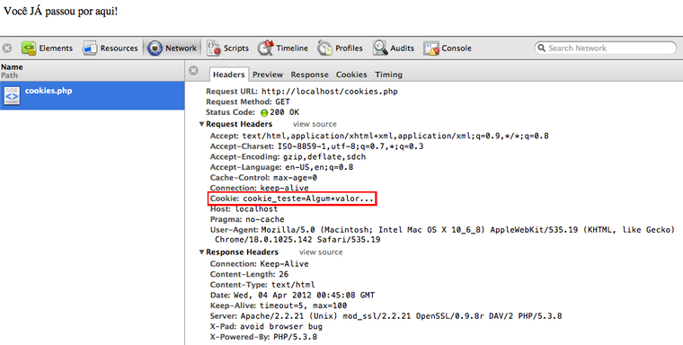

Por muito tempo eu abstrai o conceito de
_cookies_ e sessões, e nunca cheguei a prestar muita atenção no seu
funcionamento. Recentemente, trabalhando com uma infra mais preocupada
com a segurança, disponibilidade e performance, tive a oportunidade de
relembrar e me aprofundar em alguns conceitos e práticas.

O que já sabia é que os _cookies_ são “persistências temporárias” feitas
no lado do usuário, e sessões são persistências dependentes de
_cookies_, mas realizadas no lado do servidor.

A minha felicidade é que até aí, nada mudou :)

## Para que servem Cookies e Sessões?

O [protocolo *HTTP*][] é _stateless_, ou seja, ele não mantém um
estado/conexão. Toda a interação que o seu cliente fizer com um servidor
[*web*][] acarretará em uma nova requisição e resposta.

As requisições são independentes e possuem um tempo de vida (conexão,
envio de mensagem, resposta, encerramento da conexão). O servidor _web_
não é capaz de identificar se duas requisições vieram de um mesmo
navegador, e o mesmo não faz nenhum gerenciamento em memória para que
mensagens sejam compartilhadas entre requisições.

É para suprir esta necessidade que entram os _cookies_ e sessões.

## Cookies

Através de _cookies_ o servidor _web_ é capaz de trocar informações de
estado com o navegador do usuário. Desse modo, somos capazes de
adicionar produtos a um carrinho de compras, sem perder estas
informações ao mudar de página, sair do _website_ ou até mesmo fechar o
navegador.

Tecnicamente falando, um _cookie_ é uma pequena quantidade de informação
persistida temporariamente pelo navegador. Os navegadores normalmente
limitam o tamanho dos _cookies_ em até 4KB, e apagam _cookies_ com a
data de “validade vencida”.

Para entender como essa troca de informação é feita, vamos criar um
_cookie_ com o [*PHP*][]:

```php
<?php
    // cookies.php

    if (isset($_COOKIE['cookie_teste'])) {
        echo 'Você JÁ passou por aqui!';
    } else {
        echo 'Você NUNCA passou por aqui.';
        setcookie('cookie_teste', 'Algum valor...', time() + 3600);
    }
?>
```

O código acima verifica se o _cookie_ atendendo pelo identificador
`cookie_teste` já existe, caso não exista, cria um _cookie_ com
identificador `cookie_teste`, valor `Algum valor...` e com **1
hora de vida** (a hora atual mais 3600 segundos).

Quando visitamos pela primeira vez o `cookies.php`, temos a seguinte
resposta:

```text
$ curl -I localhost/cookies.php

HTTP/1.1 200 OK
Date: Wed, 04 Apr 2012 00:35:33 GMT
Server: Apache/2.2.21 (Unix) mod_ssl/2.2.21 OpenSSL/0.9.8r DAV/2 PHP/5.3.8
X-Powered-By: PHP/5.3.8
Set-Cookie: cookie_teste=Algum+valor...; expires=Wed, 04-Apr-2012 01:35:33 GMT
Content-Type: text/html
```

Através da função `setcookie` do _PHP_, estamos enviando um item
chamado `Set-Cookie` no cabeçalho _HTTP_ da resposta. É através deste
que o navegador entende que deve armazenar o valor `Algum valor…`,
atendendo pelo identificador `cookie_teste`, e que esta informação
expira em 1 hora (verifique a data da requisição e a data de validade do
_cookie_).

Na próxima vez que o navegador acessar esta _URL_, ele verificará se
possui algum _cookie_ para aquele domínio e _path_, caso exista, ele
passa as informações do _cookie_ no cabeçalho da requisição. Desse modo,
a nossa aplicação é capaz de perceber a existência de um _cookie_ (no
caso do _PHP_, através do _array_ global `$_COOKIE`).

Abaixo, um exemplo de requisição utilizando o _Google Chrome_:



[Clique para ampliar](/images/blog/exemplo-php-cookies.png)

Se excluirmos os _cookies_, ou o tempo de expiração for atingido, o
navegador deixa de anexar esta informação ao cabeçalho da requisição.

## Sessões

As sessões têm um princípio similar aos _cookies_, só que o
armazenamento do estado é feito pelo servidor _web_, e não pelo
navegador.

Por exemplo, quando construímos uma aplicação que necessita de
autenticação, no momento em que o usuário efetuar o _login_, podemos até
permitir que algumas informações sejam armazenadas em um _cookie_, mas
dados mais “sensíveis”, como usuário e _e-mail_, são mais interessantes
de serem guardadas em sessões. Isto, pois **não é seguro** que esse tipo
de informação fique “viajando” pela _web_.

Mas se o _HTTP_ é _stateless_, e o servidor _web_ não tem como
identificar que a requisição anterior veio do meu _browser_, como é que
ele sabe que as informações que eu guardei em sessão são de fato minhas?
Simples… **através de _cookies_!**

Quando iniciamos uma sessão, é enviado um _cookie_ para o navegador, com
um valor único que corresponde a sessão aberta no servidor _web_. Vamos
ilustrar através do exemplo abaixo:

```php
<?php
    // sessions.php

    session_start();

    if (isset($_SESSION['usuario'])) {
        echo "Bem vindo {$_SESSION['usuario']}!";
    } else {
        echo 'Você NUNCA passou por aqui.';
        $_SESSION['usuario'] = 'João';
    }
?>
```

O código acima inicia uma sessão através do método `session_start`.
Na primeira visita, será criado um índice `usuario` com o valor
`João`. A resposta da nossa requisição será a seguinte:

```text
$ curl -I localhost/sessions.php

HTTP/1.1 200 OK
Date: Wed, 04 Apr 2012 01:51:57 GMT
Server: Apache/2.2.21 (Unix) mod_ssl/2.2.21 OpenSSL/0.9.8r DAV/2 PHP/5.3.8
X-Powered-By: PHP/5.3.8
Set-Cookie: PHPSESSID=4h91dkp7pcp8184nil8rt9ok13; path=/
Expires: Thu, 19 Nov 1981 08:52:00 GMT
Cache-Control: no-store, no-cache, must-revalidate, post-check=0, pre-check=0
Pragma: no-cache
Content-Type: text/html
```

Por partes:

- Como mencionei, `Set-Cookie` foi retornado com um identificador
  (`PHPSESSID`) e um valor que corresponde a sessão aberta no
  servidor (`4h91dkp7pcp8184nil8rt9ok13`). O complemento `path`
  está “dizendo” ao navegador que aquele _cookie_ tem validade por
  todo o domínio (ou seja, valerá inclusive para outros arquivos _PHP_
  em outras subpastas). Quando não é informada a data de expiração, o
  navegador manterá o _cookie_ até o momento em que ele for fechado.
- O _PHP_ tomou a liberdade de adicionar alguns cabeçalhos de controle
  de _cache_ (`Expires`, `Cache-Control` e `Pragma`) à nossa
  resposta. Em resumo, o servidor está dizendo ao navegador para que
  não armazene esta página em _cache_. Estes valores podem ser
  alterados em [tempo de desenvolvimento][], ou [através do **php.ini**][].
- Em nenhum momento o _Apache_ informou ao navegador que temos um
  índice `usuario` com o valor `João`. Estas informações estão
  disponíveis somente no lado do servidor.

Quando visitarmos o `sessions.php` novamente, o navegador informará ao
servidor que ele possui um _cookie_ chamado `PHPSESSID`. A partir daí
o _PHP_ pega o valor deste _cookie_, recupera a sessão da memória (ou de
um banco de dados, ou arquivos em disco) e atribui este valor ao _array_
global `$_SESSION`.

O nome do _cookie_ varia de linguagem para linguagem e até mesmo de
_framework_ para _framework_. Por exemplo, no [*Django*][] ele é chamado
por padrão de `sessionid`, no [*CodeIgniter*][] é chamado de
`ci_session`.

## Considerações finais

Gostei muito de me aprofundar um pouquinho mais neste assunto, e gostei
mais ainda de poder traduzir este aprendizado através deste _post_.

É claro que há alguns cuidados com segurança quando o assunto é
_cookies_ e sessões, bem como considerações em relação ao uso de
_cache_. Pretendo falar mais sobre esses temas em _posts_ vindouros.

Até a próxima…

## Referências

- [*PHP Manual – Session Handling*][]
- [*Stanford.edu – CS 142: Cookies and Session*][]
- [*Wagner Elias* – *HTTP Essentials*][]
- [*Wagner Elias* – Segurança de *Cookies* de sessão e *HTTPOnly*][]
- [*Wikipedia – HTTP Cookie*][]

[protocolo *http*]: http://wagnerelias.com/2009/02/06/http-essentials/ "Conheça mais sobre o protocolo HTTP"
[*web*]: /tag/desenvolvimento-web.html "Leia mais sobre Web"
[*php*]: /tag/php.html "Leia mais sobre PHP"
[tempo de desenvolvimento]: http://www.php.net/manual/en/ref.session.php "PHP: Session functions"
[através do **php.ini**]: http://www.php.net/manual/en/session.configuration.php "PHP: Runtime configuration"
[*django*]: /tag/django.html "Leia mais sobre Django"
[*codeigniter*]: /tag/codeigniter.html "Leia mais sobre CodeIgniter"
[*php manual – session handling*]: http://www.php.net/manual/en/book.session.php "Confira a documentação oficial do PHP que fala sobre Sessões"
[*stanford.edu – cs 142: cookies and session*]: http://www.stanford.edu/~ouster/cgi-bin/cs142-fall10/lecture.php?topic=cookie "Material resumido, mas muito bom, sobre sessões e Cookies"
[*wagner elias* – *http essentials*]: http://wagnerelias.com/2009/02/06/http-essentials/ "Wagner nos apresenta de forma objetiva o funcionamento do protocolo HTTP"
[*wagner elias* – segurança de *cookies* de sessão e *httponly*]: http://wagnerelias.com/2009/04/21/seguranca-de-cookies-de-sessao-e-httponly/ "Entenda as falhas de segurança apresentadas com o uso de sessões e cookies"
[*wikipedia – http cookie*]: http://en.wikipedia.org/wiki/HTTP_cookie "Leia este bom artigo em inglês sobre Cookies"
