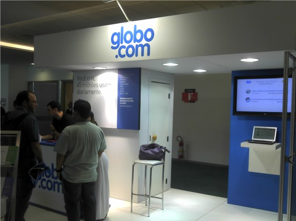
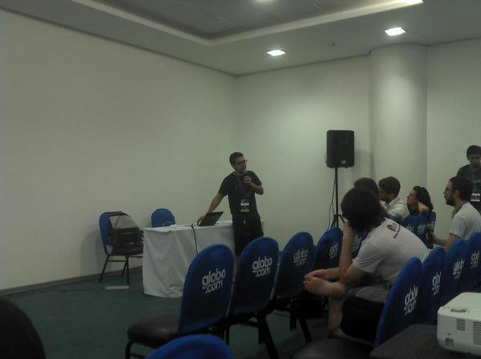

Nos dias 21 a 24 de Novembro de 2012 aconteceu
a [*Python Brasil*][]. Em sua oitava edição, o evento mais aguardado
pelos desenvolvedores [*Python*][] “tupiniquins” me surpreendeu
completamente. Um dos melhores eventos que participei nos últimos
tempos!

E não é só pelo conteúdo apresentado durante as palestras, ou pelos
convidados especiais que deram um show a parte em suas apresentações,
mas esse “sentimento” deve-se ao fato de ser a primeira vez que fiquei
tão próximo da comunidade _Python_, e me senti muito feliz por
compartilhar estes dias com pessoas tão bacanas e interessantes.

## Expectativas

Nunca tive dúvidas em relação a qualidade do evento, pelo contrário,
várias pessoas que conheço já haviam participado e deram um bom
_feedback_. A [*Globo.com*][] é “figurinha carimbada” no evento,
portanto vários colegas de trabalho já haviam participado, seja como
expectador ou como palestrante.

Mas a minha expectativa maior estava em relação às pessoas. Estar entre
o pessoal era algo muito difícil para mim (geograficamente falando),
então conhecer alguns profissionais que acompanho pelo [*Twitter*][] era
uma das metas que eu tinha para o evento.

## Resultados

Não consegui assistir aos tutoriais, logo, meu _feedback_ será
totalmente focado nas palestras.

Acredito que a melhor maneira de resumir o resultado é: **Não vejo a
hora de participar da _Python_ Brasil 9**.

O evento contou com alguns probleminhas de atrasos, e em alguns momentos
de conectividade, mas fora isso foi excelente! O [local][], bem
posicionado no centro do Rio de Janeiro, possuía um grande espaço. As
salas para as apresentações eram de fácil acesso. A [programação][]
estava excelente, contando com palestras que iam de provisionamento com
_Puppet_ até programação com o _Raspberry Pi_.

Fiquei muito feliz por ter participado do evento, e transmito os meus
parabéns a todos os envolvidos. Um trabalho duro, de fato, mas muito bem
executado.

Em tempo… o café do pessoal do [*Curto Café*][] estava sensacional! Vale
a recomendação… café feito com muita paixão.

## As palestras

Não pretendo descrever como foi cada palestra, apenas levantar alguns
pontos marcantes. Por exemplo, [*Massimo Di Pierro*][], _lead developer_
da _Web2Py_, fez a seguinte declaração:

> Todo mundo deveria programar, pois gera valor, e pode ser descartado sem avarias ao meio ambiente.

A palestra do _Massimo_ foi muito boa, focada nas facilidades de uso do
_Web2Py_. Algumas declarações como “convention over configuration” foram
um tanto controversas, mas ele conseguiu passar o seu ponto.

_Sergio Oliveira_ e _Davi Oliveira_ falaram sobre _Puppet_, e
demonstraram ao vivo o seu uso. O [*GitHub* da *TracyWebTech*][] possui
uma série de _scripts_ para provisionamento prontos, que valem a pena
dar uma olhada. Ainda em provisionamento, _Diogo Baeder_ e _Bernardo
Heynemann_ falaram sobre o [*Provy*][], uma forma de provisionar
servidores “feita para desenvolvedores” (e em _Python_ (: ).

Uma das melhores palestras do evento foi a do _Tarek Ziade_ sobre o
[*Circus*][]. A apresentação pode ser [conferida aqui][]. É bom conhecer
uma alternativa mais rica ao [*Supervisor*][], com monitoramento em
tempo real e um _console Web_ para gerenciamento.

O _Tarek_ falou também sobre empacotamento em _Python_. Eu acho a
experiência do _pip_ e _PyPI_ excelente, e acho que o empacotamento é
um ponto fortíssimo da linguagem. Mas, [segundo a sua apresentação][], o
palestrante conseguiu levantar alguns pontos negativos, e salientou o
árduo caminho que o _Python_ trilhou para chegar até o momento atual.
Vale a pena conferir!

_Bob Hancock_ marcou presença com a sua palestra sobre paralelismo e
concorrência, disparando uma série de frases que “reverberaram” pelo
_Twitter_:

- PyPy is not the salvation!
- Be an Engineer and not a Developer.
- Don’t write another Web Framework.

Outras tantas palestras foram sensacionais, como a do _Bruno Rocha_
sobre _Whoosh_, ou do _Andrews Medina_ sobre _refactoring_. Pretendo
escrever _posts_ específicos com o conteúdo destas, portanto, não vou
tornar este _post_ mais longo e vou parar por aqui.

Até a próxima…

[*python brasil*]: http://2012.pythonbrasil.org.br/ "Visite o site oficial do evento"
[*python*]: /tag/python.html "Leia mais sobre Python"
[*globo.com*]: http://www.globo.com/ "Visite o portal da Globo.com"
[*twitter*]: http://www.twitter.com/kplaube/ "Siga-me no Twitter"
[local]: http://2012.pythonbrasil.org.br/venue/ "Centro de Convenções Sul América, no Rio de Janeiro"
[programação]: http://2012.pythonbrasil.org.br/schedule/ "Conheça o conteúdo apresentado na Python Brasil 2012"
[*curto café*]: http://www.facebook.com/curtocafe "Visite a página no Facebook"
[*massimo di pierro*]: http://www.web2py.com/examples/default/who "Conheça os contribuidores da Web2Py"
[*github* da *tracywebtech*]: http://github/tracywebtech "Perfil da TracyWebTech no GitHub"
[*provy*]: http://heynemann.github.com/provy/ "Provisionamento para desenvolvedores"
[*circus*]: http://circus.readthedocs.org/en/0.5.2.1/ "A Process & Socket Manager"
[conferida aqui]: http://blog.ziade.org/slides/pyconbrazil2012/circus.html "Veja a apresentação do Tarek na Python Brasil"
[*supervisor*]: /2012/01/23/supervisor-gerencie-os-processos-seu-servidor-web.html "Aumentando a disponibilidade das suas aplicações Web"
[segundo a sua apresentação]: http://blog.ziade.org/slides/pyconbrazil2012/packaging.html "Confira a palestra do Tarek sobre empacotamento com Python"
